<!--
  Bhargav Rathod — profile README.
  Every visual is an animated SVG tile in assets/readme (generated by tools/build_tiles.py).
  Tiles are written back-to-back with align="top" so they render as one seamless canvas:
  keep the tags touching (no blank lines or spaces between them) when editing.
  The three Signal panels are regenerated twice a day by .github/workflows/signal.yml into the `output` branch.
-->

<a
 href="https://bhargavrathod07.github.io/Portfolio-Website/"></a><a
 href="https://bhargavrathod07.github.io/Portfolio-Website/"></a><a
 href="https://www.linkedin.com/in/bhargav-rathod-rb07082006/"></a><a
 href="https://leetcode.com/u/BHARGAV_RATHOD_782006/"></a><a
 href="https://github.com/BHARGAVRATHOD07"></a><a
 href="https://gitclub.hogwartsxcharusat.workers.dev/"></a><a
 href="https://bhargavrathod07.github.io/Portfolio-Website/"></a>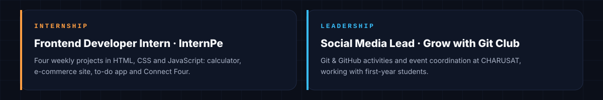

