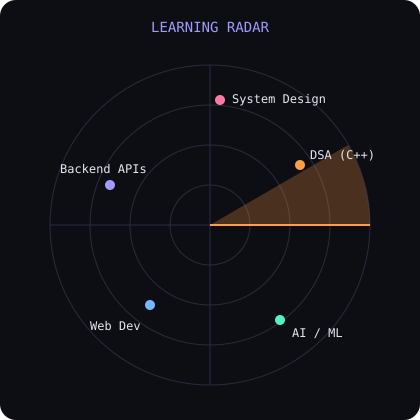
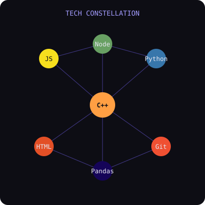

  

  
  
  
  

  

<h1 align="center">Hi 👋, I'm Bhargav Rathod</h1>

<h3 align="center">💻 Software Developer | 🚀 3rd Year Computer Science Engineering Student | 🤖 AI & ML Enthusiast</h3>

Passionate about building scalable applications, solving challenging problems through DSA, and exploring Artificial Intelligence.

## 🚀 About Me

- 🎓 3rd Year Computer Science Engineering Student
- 💻 Passionate about Software Development & Full-Stack Web Development
- 🧠 Regularly solving Data Structures & Algorithms
- 🤖 Currently learning Machine Learning & Artificial Intelligence
- 🌱 Exploring System Design & Cloud Computing
- 💼 Web Development Intern at InternPe
- 🎯 Aspiring Software Engineer at a Product-Based Company

## 🛠️ Tech Stack

### 💻 Languages

### 🌐 Web Development

### 🧰 Tools

<!-- Paste any other badges from your old README here (databases, frameworks, etc.) -->

## 📂 Projects

| Project | What it is | Stack |
| --- | --- | --- |
| **Git Club Event Website** | Harry Potter-themed website for the Grow with Git Club event at CHARUSAT | `HTML` `CSS` `JavaScript` |
| **Hadoop Matrix Multiplication** | Matrix multiplication using MapReduce on HDFS/YARN | `Hadoop` `MapReduce` |
| **Used Car Price Prediction** | ML model to predict used-car prices | `Python` `Pandas` `Scikit-Learn` |
| **Personal Portfolio** | Responsive portfolio built from scratch | `HTML` `CSS` `JavaScript` |

## 📡 Current Exploration

  
  

## 📊 GitHub Stats

  
  

  

Built from scratch. Always learning. ✨

